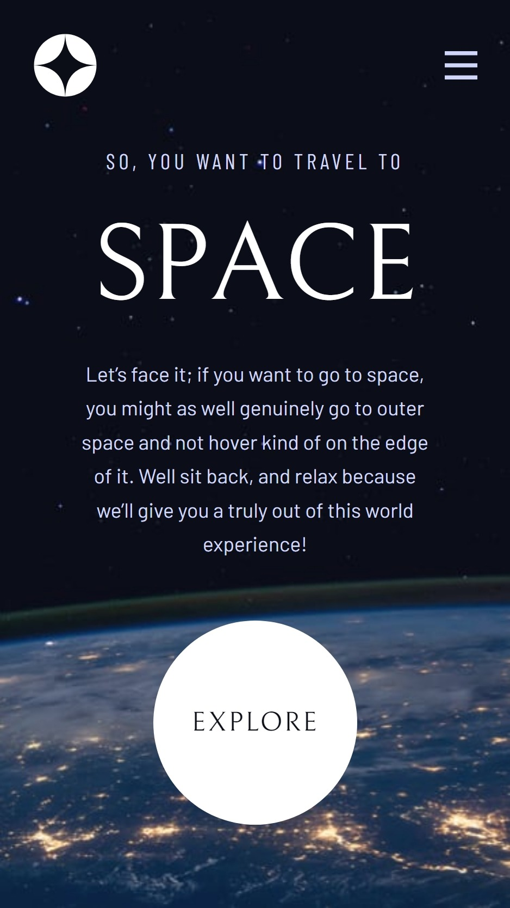

# Frontend Mentor - Space tourism website solution

This is a solution to the [Space tourism website challenge on Frontend Mentor](https://www.frontendmentor.io/challenges/space-tourism-multipage-website-gRWj1URZ3). Frontend Mentor challenges help you improve your coding skills by building realistic projects. 

# Table of contents

- [Frontend Mentor - Space tourism website solution](#frontend-mentor---space-tourism-website-solution)
- [Table of contents](#table-of-contents)
- [Overview](#overview)
  - [The challenge](#the-challenge)
  - [Screenshot](#screenshot)
  - [Links](#links)
  - [Built with](#built-with)
  - [What I learned](#what-i-learned)
    - [dynamic import images in Vite](#dynamic-import-images-in-vite)
    - [framer motion  - custom component with motion](#framer-motion----custom-component-with-motion)
    - [TS - React HOC + forwardRef](#ts---react-hoc--forwardref)
  - [Continued development](#continued-development)
- [Author](#author)

# Overview
## The challenge
Users should be able to:

- [X]  View the optimal layout for each of the website's pages depending on their device's screen size
- [X]  See hover states for all interactive elements on the page
- [X]  View each page and be able to toggle between the tabs to see new information

## Screenshot
- desktop  

- mobile  


## Links

- 👉 [Solution URL](https://www.frontendmentor.io/solutions/react-reactrouter-typescript-styledcomponents-spa-website-LWIPP_xMq5)
- 👉 [Live Site URL](https://meitung473.github.io/space-tourism-website/home)

## Built with

- Semantic HTML5 markup
- Flexbox
- CSS Grid
- [React](https://reactjs.org/) - JS library
- [Styled Components](https://styled-components.com/) - For styles
- [React-router]() - router
- [Vite]() - fast bundler
- [react-spinners]() - React spinner component library


## What I learned
### dynamic import images in Vite
[Doc ref](https://vitejs.dev/guide/assets.html#new-url-url-import-meta-url)

according official doc : 
```js
new URL('/assets/' + path,import.meta.url).href
```

dynamic import : use Template literals string
```js
new URL(`/assets/${imagePath}`,import.meta.url).href
```  

I used to re-define a function and import it into `<Carousel/>` .
It doesn't resolve a image path. I figure out that it should be "static".  

official doc advise : 
```js
function getImageUrl(name) {
  return new URL(`./dir/${name}.png`, import.meta.url).href
}
```
Usage : 
```tsx
function Image() {
    const { type, content } = useCarouselContext();
    const { images, name } = content as TContentType;

    if (type !== "image") return null;
    return (
        <ImageStyle
            name={name}
            defaultSrc={
                // ❌ not resolve assets 🥺
                getImageUrl(importImage(images.png))
            }
        >
            <source
                srcSet={
                    // ✅ it's works
                    new URL(
                        `../../assets/${importImage(images.webp)}`,
                        import.meta.url
                    ).href
                }
                type="image/webp"
            />
        </ImageStyle>
    );
}
```

### framer motion  - custom component with motion
In the project, I have to animate `<Link/>` which is a component of react-router. It should be using `React.forwardRef` to get its ref. With its method and motion function, another library's components could be animated.  

```jsx
import { motion, MotionProps } from "framer-motion";
import React from "react";
import { Link, LinkProps } from "react-router-dom";

interface Props {
    children?: React.ReactNode;
}

const ForwardedLink = React.forwardRef<
    HTMLAnchorElement,
    Props & MotionProps & LinkProps
>((props, ref) => {
    const { children, ...restProps } = props;
    return (
        <Link ref={ref} {...restProps}>
            {children}
        </Link>
    );
});
const MotionLink = motion(ForwardedLink);
```

### TS - React HOC + forwardRef
- T : WrappedComponent Props
- P : as new Component Props

Because wrapped component content comes from a different page, it should depend on what data is with the router path.  

```jsx
export interface IWithOutletContainerProps<T> {
    content: T;
}
type Props = {
    children?: React.ReactNode;
};

// for carousel content need to position with portal (HTML)
export default function withOutletContainer<
    T,
    P extends Partial<IWithOutletContainerProps<T>> & Props
>(WrappedComponent: React.ComponentType<T>) {
    const Component = React.forwardRef<React.Ref<T>, P>((props, ref) => {
        const { children, ...restProp } = props;
        const paths = useNestedPath();
        if (typeof paths === "undefined") return null;
        return (
            <WrappedComponent $path={paths[1]} ref={ref} {...(restProp as T)}>
                {children}
            </WrappedComponent>
        );
    });
    Component.displayName = `withOutletContainer(${getDisplayName(
        WrappedComponent
    )})`;
    return Component;
}
```

## Continued development
- [ ] fix layout-shifting to improve Core Web Vital CLS  : add static height and width

# Author

- Website - [My Blog (Chinese)](https://blog.rosa.tw)
- Frontend Mentor - [@meitung473](https://www.frontendmentor.io/profile/yourusername)


